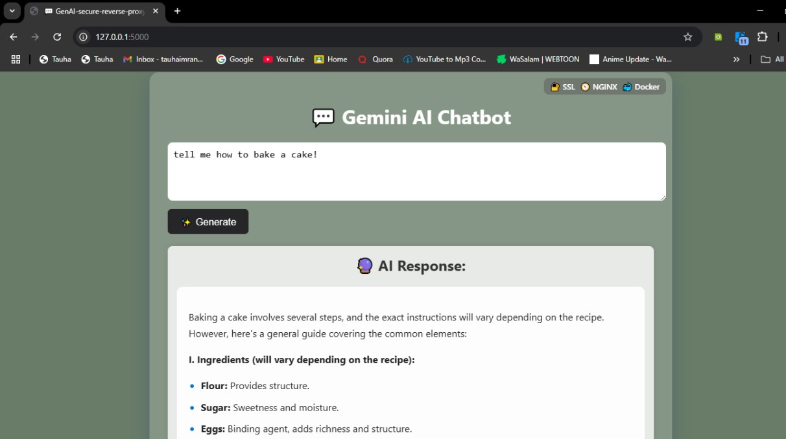

# 🔒 GenAI Secure Reverse Proxy

A containerized Flask web application that integrates with an external **API**, secured using **Nginx** reverse proxy and **SSL**, and orchestrated with **Docker Compose**.

> 🧰 A practical DevOps project featuring API consumption, containerization, secure traffic routing, and deployment automation.

---

## 🚀 Live Demo & Blog

- 🌐 **Live App**: [https://genai-proxy.up.railway.app](https://genai-proxy.up.railway.app) *(Coming soon - Hosted on Railway)*
- 📝 **Blog Post**: [How I Built a Secure Reverse Proxy with Nginx, Docker & SSL](https://www.linkedin.com/posts/tauha-imran-6185b3280_devops-docker-flask-activity-7349143758220791809-TiTN?utm_source=share&utm_medium=member_desktop&rcm=ACoAAERujrQBDz_-twYMisiFReEvfdGkbhb4KpM) *(Coming soon)*

---

## 📸 Screenshot

<p align="center">
  
</p>


<p align="center">
  
</p>

---

## 📦 Project Structure

```
├── app/ # Flask or backend application
│ └── ...
├── nginx/
│ └── nginx.conf # Nginx reverse proxy config
├── docs/
│ └── app-demo.jpg # Screenshot/demo image
├── certs/
│ ├── selfsigned.crt # SSL certificate
│ └── selfsigned.key # SSL private key
├── docker-compose.yaml # Compose config for web + nginx
├── .env # Not included — provide your own API keys
└── README.md
```

---

## 🔧 Tech Stack

- 🐍 **Flask** – Lightweight Python web app
- 🐳 **Docker** – Containerized setup for portability
- 🌐 **Nginx** – Acts as secure reverse proxy
- 🔐 **SSL** – Self-signed certs for HTTPS
- ⚙️ **Docker Compose** – Multi-service orchestration
- ☁️ **Railway** – Cloud hosting & deployment (in process)

---

## 🛠️ Features

- ✅ Flask app fetches data from an external API
- ✅ Reverse proxy via Nginx
- ✅ HTTPS support with self-signed certs
- ✅ Auto-redirect HTTP → HTTPS
- ✅ Fully containerized with Docker
- ✅ Ready for production deployment

---

## 🧪 Running Locally

### 1. Generate a self-signed SSL certificate

```bash
mkdir -p certs
openssl req -x509 -nodes -days 365 -newkey rsa:2048 \
  -keyout certs/selfsigned.key \
  -out certs/selfsigned.crt \
  -subj "/CN=localhost"
```

2. Start the app with Docker Compose

```
docker compose up --build
```

3. Access locally

Visit: http://localhost → redirects to

Secure: https://localhost

Expect a browser warning for the self-signed cert — it's safe to continue.

🧪 Testing via Curl
```
curl -k https://localhost
```
The -k option skips SSL verification (needed for self-signed certs).

🗂️ .env Support
Add your API keys or configs inside a .env file in the root (not committed).
Example (.env file) :

```
API_KEY=your_api_key_here
FLASK_ENV=development
```

📄 License
n/a

🙋‍♂️ Author
Built by Tauha Imran
Connect on LinkedIn
